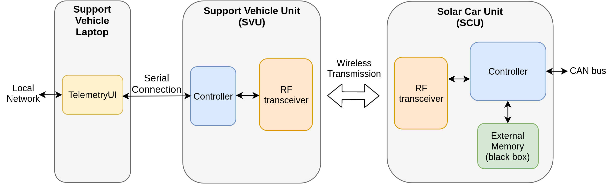
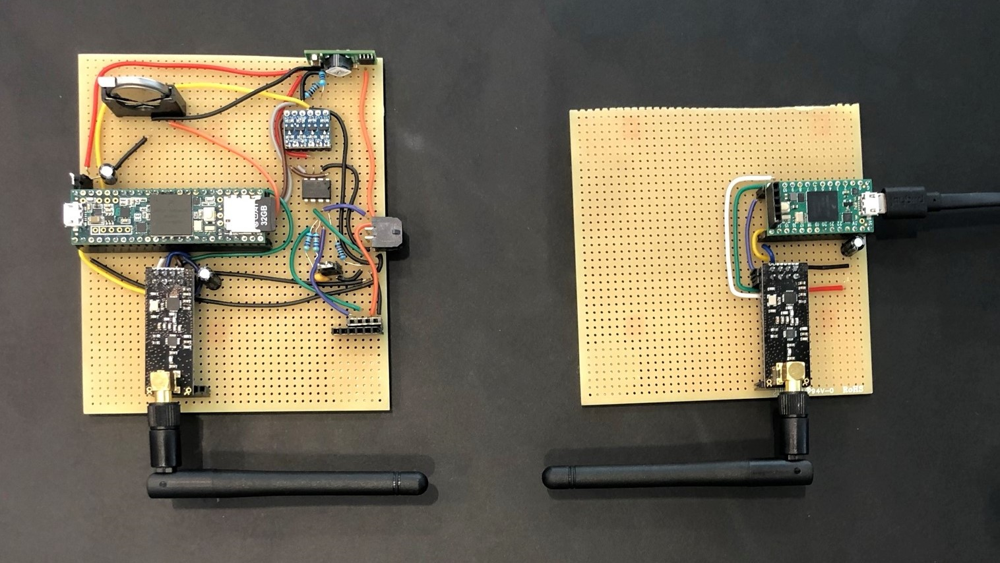

# Telemetry Module for DTU Roadrunners Solar Car

The repository of a project conducted at DTU in course 31015 by:
- Tjark Petersen
- Steffan Martin Kunoy
- Victor Alexander Hansen

This project presents a telemetry system for the DTU Roadrunners solar car. The software and hardware developed for the telemetry system provides a two-way communication between the solar car and a support vehicle. The solar car module can read data from the CAN bus, store it locally in a black box and stream it to the support vehicle. In return the support vehicle can send commands to the solar car. All messages are secured with an RSA encryption. A graphical user interface enables the user to stream the CAN data and send commands. In addition, support for a simple UDP network stream was also implemented which can for instance be accessed in Matlab.

A provisional hardware setup of the solar car and support vehicle modules was implemented using two Teensy microcontrollers on perfboards. A range test of the two modules had a successful and reliable transmission distance of up to around 160 m. While this does not satisfy the original goal of 400 m - 1000 m, the final solution is concluded to have a good communication chain design between the solar car and support vehicle modules, and can be readily improved upon to support a longer transmission distance. 

# Resources

The code for the two microcontrollers can be found in [this](../Software/src/telemetry) folder. The code for the user interface is located in the [TelemetryUI](TelemetryUI) folder.

An example showing how to access the UDP stream in Matlab is shown [here](matlab/udpClient.m).

The paper connected to the project can be found [here](documentation/DTU_Roadrunners_Solar_Car_Telemetry_Paper.pdf) and a project poster can be found [here](documentation/DTU_Roadrunners_Solar_Car_Telemetry_Poster.pdf).

# Pictures

---

